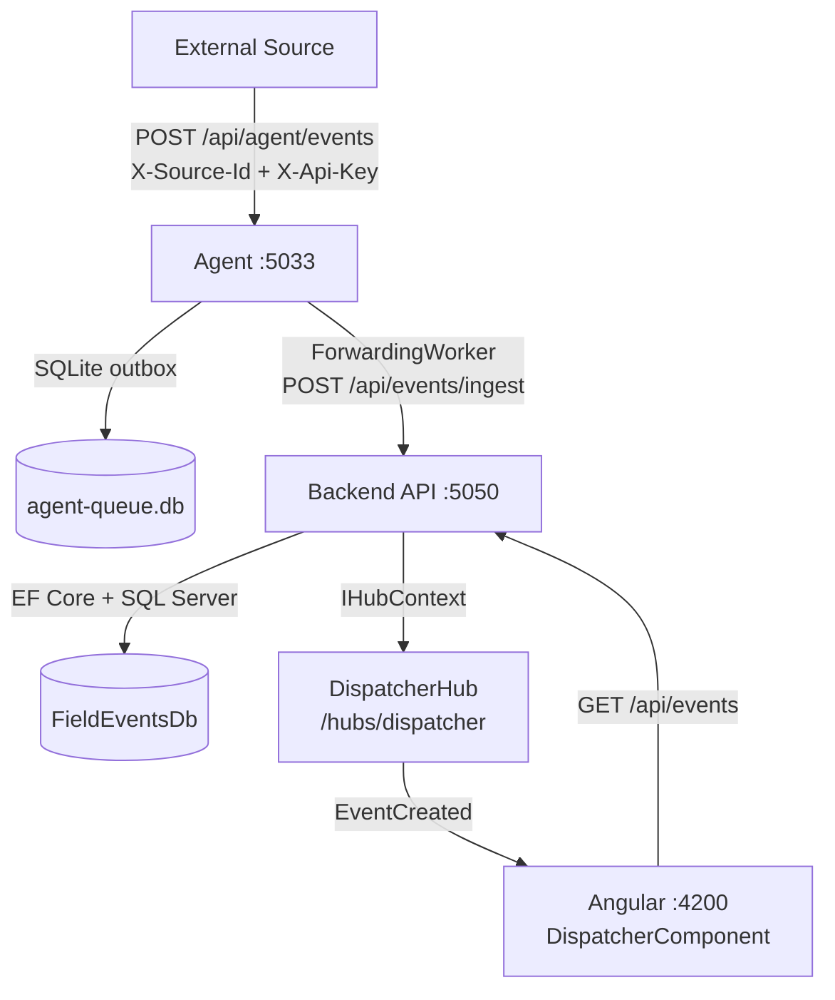

# Architecture

---

## 1. Architecture overview

The system is a **modular monolith** backend paired with a separate **Agent** process and an
**Angular** SPA. The Agent is the only separately deployable process because it has a distinct
reliability boundary: it must accept and durably queue events even when the Backend is unavailable.

---

## 2. Architecture diagram

---

## 3. Responsibility of each component

### FieldEvents.Domain
Pure C# class library. Zero external dependencies.
Contains the `FieldEvent` aggregate, `EventStatus`/`EventPriority` enums, state machine
enforcement via `ChangeStatus`, `EventStatusHistory`, `EventAssignment`, and domain exceptions.

### FieldEvents.Application
Class library. Depends only on Domain.
Contains use cases (`IIngestEventUseCase`, `IGetRecentEventsUseCase`) and skeleton interfaces
(`IAssignEventUseCase`, `ITransferEventUseCase`, `IChangeEventStatusUseCase`,
`ICloseEventUseCase`, `IAddEventCommentUseCase`, `IGetTechnicianEventsUseCase`),
command/query DTOs, response DTOs, and service abstractions
(`IEventNotificationService`, `IUserNotificationService`).

### FieldEvents.Infrastructure
Class library. Depends on Application and Domain.
Implements `FieldEventsDbContext` (EF Core + SQL Server), Fluent API entity configurations,
`IngestEventUseCase`, `GetRecentEventsUseCase`, `WebPushNotificationService` (stub),
and `IDesignTimeDbContextFactory` for migrations.

### FieldEvents.Api
ASP.NET Core Web API. Depends on Application and Infrastructure.
Contains `EventsController` (GET + POST ingest), `DispatcherHub` (SignalR),
`SignalREventNotificationService`, CORS policy for Angular dev server, and DI root.

### FieldEvents.Agent
ASP.NET Core Minimal API. **No project references to any Backend project.**
Receives events from external sources via `POST /api/agent/events`,
authenticates with SHA-256 API-key hashing + constant-time comparison,
persists to SQLite via `AgentDbContext`, returns `202 Accepted` immediately,
and uses `ForwardingWorker` (BackgroundService) to forward to Backend with exponential backoff.

### field-events-ui
Angular 19+ SPA. Communicates with Backend over REST (`GET /api/events` on load)
and SignalR (`/hubs/dispatcher` for live `EventCreated` events).
Shows a connection status indicator and prepends new events to the table without page refresh.
A skeleton `TechnicianComponent` is routed at `/technician`.

---

## 4. Agent design

### Flow
1. External source posts to `POST /api/agent/events` with `X-Source-Id` and `X-Api-Key` headers.
2. Agent validates headers: SHA-256 hash of provided key compared to stored hash via constant-time equality.
3. Agent writes full payload to `OutboxMessages` table in SQLite.
4. Agent returns `202 Accepted` immediately — external source is never blocked on Backend availability.
5. `ForwardingWorker` polls every 5 seconds for pending messages where `Status=Pending` and `RetryCount<10`.
6. Worker posts each message to Backend `POST /api/events/ingest`.
7. On `200`/`201` from Backend: marks message `Status=Delivered`, records `DeliveredAt`.
8. On any other response or network error: increments `RetryCount`, sets `NextRetryAt` with
   exponential backoff (`5s, 15s, 30s, 1m, 2m, 5m, 10m, 15m, 30m, 30m`), records `LastError`.
9. Messages are never deleted — the full delivery history is preserved in SQLite.
10. Duplicate events (same `SourceId:ExternalEventId` idempotency key) are rejected at the Agent
    with `202` (to the caller) and not enqueued again.

---

## 5. Communication between Agent and Backend

The Agent calls `POST /api/events/ingest` on the Backend over HTTP.
The Backend URL is configured via `Agent:BackendBaseUrl` in `appsettings.json`
(override via `AGENT__BACKENDBASEURL` environment variable in production).

The Agent does **not** use a shared API key with the Backend for the ingestion path.
The Backend trusts all inbound `POST /api/events/ingest` calls (network-level trust expected in production;
a dedicated `X-Agent-Key` header can be added without domain changes).

---

## 6. Reliability and failure handling

**Agent reliability:**
- Events are persisted to SQLite before `202 Accepted` is returned to the external source.
- Restart of the Agent process does not lose pending events (SQLite is durable).
- Exponential backoff prevents overwhelming a recovering Backend.
- `ForwardingWorker` processes up to 10 messages per poll cycle (batch size).

**Backend reliability:**
- Idempotency: `UNIQUE(SourceId, ExternalEventId)` database constraint prevents duplicate events
  from retried Agent deliveries. Pre-check + catch-on-conflict race-safe pattern is used.
- EF Core `SaveChangesAsync` is atomic for the event + initial status history record.

**SignalR reliability gap:**
The SignalR `EventCreated` notification is sent after `SaveChangesAsync` completes but is not
atomic with the database write. A process crash between the DB commit and the SignalR send
means connected clients miss the notification. Clients recover by reloading (database is source
of truth for `GET /api/events`).

**Production improvement — Transactional Outbox:**
Write a pending SignalR outbox record inside the same EF Core transaction.
A background worker reads and delivers it, then marks it delivered.
This closes the notification gap without XA transactions.

---

## 7. Idempotency

The Backend enforces idempotency with a unique database constraint:
`UQ_FieldEvents_SourceId_ExternalEventId` on `(SourceId, ExternalEventId)`.

**Flow:**
- First delivery (new `SourceId` + `ExternalEventId`): event created, `201 Created` returned.
- Retry delivery (same keys): unique constraint race caught by `DbUpdateException`.
  The existing event is fetched and returned with `200 OK`.
- Pre-check optimisation: an `AsNoTracking` query runs before the insert to avoid the exception
  on the hot path; the catch handles the race between pre-check and insert.

The Agent also deduplicates at its own level via `UQ_OutboxMessages_IdempotencyKey`,
so the same event is enqueued at most once regardless of how many times the external source retries.

---

## 8. Real-time communication

SignalR is used to push `EventCreated` notifications to all connected Dispatcher clients.

**Implementation:**
- `DispatcherHub : Hub` — server-to-client only, no client-callable methods.
- `SignalREventNotificationService` implements `IEventNotificationService` using `IHubContext<DispatcherHub>`.
- `EventsController.Ingest` calls `NotifyEventCreatedAsync(ev)` immediately after `SaveChangesAsync`.
- Angular `EventRealtimeService` uses `HubConnectionBuilder.withUrl('/hubs/dispatcher').withAutomaticReconnect()`.
  Connection lifecycle events (`onreconnecting`, `onreconnected`, `onclose`) emit to an RxJS `Subject<ConnectionStatus>`.
- The `EventCreated` message carries the full `IngestEventResponse` payload and is emitted via an RxJS `Subject<FieldEvent>`.
- The `App` component (Dispatcher) subscribes to both subjects in `ngOnInit` and stores results in
  **Angular Signals** (`signal<FieldEvent[]>`, `signal<ConnectionStatus>`), with a `computed` signal for
  the display label. This avoids `BehaviorSubject` in the component and gives fine-grained reactivity.
- Incoming events are prepended: `events.update(current => [ev, ...current])`.
- On reconnect, Angular re-fetches the full event list via `GET /api/events` (handled on `ngOnInit`;
  future improvement: explicit re-fetch in the `onreconnected` callback).

---

## 9. Connected vs disconnected notification delivery

**Connected users (browser open):** SignalR delivers `EventCreated` in real time.

**Disconnected users (browser closed):**
`IUserNotificationService` is defined in the Application layer and implemented by
`WebPushNotificationService` (stub) in Infrastructure.
The stub logs the notification that *would* be sent but takes no real action.

Full Web Push requires:
- VAPID key pair (private key in secrets, public key embedded in Angular service worker)
- A `PushSubscriptions` table in the database (see data-model.md)
- `PushManager.subscribe()` in the Angular service worker
- A Web Push library on the server (e.g. `Lib.AspNetCore.WebPush`)

See [offline-pwa-design.md](offline-pwa-design.md) for the full offline/PWA design.

---

## 10. Authentication and authorization

**Current state (not fully implemented):**
- The ingestion path (`POST /api/events/ingest`) is unauthenticated at the Backend level.
  Network-level trust is assumed (Agent and Backend on the same internal network).
- The Agent authenticates external sources via `X-Source-Id` + `X-Api-Key` headers
  (SHA-256 hash comparison, constant-time equality to prevent timing attacks).
- A `Users` table and `SourceSystems` table are defined and migrated in SQL Server.
- A fixed `AgentServiceAccountId` placeholder is used for the ingestion identity.

**Intended full implementation:**
- JWT Bearer tokens issued by `POST /api/auth/login` (email + password → JWT).
- Two roles: `Dispatcher` and `Technician`.
- All mutating endpoints protected with `[Authorize(Roles = "...")]`.
- `X-Agent-Key` header on `POST /api/events/ingest` validated against a hashed key in `SourceSystems`.
- Technician identity always read from JWT claims, never from the request body.

---

## 11. Data model

See [data-model.md](data-model.md) for the full table definitions and ERD.

**Implemented tables (SQL Server migration applied):**
`FieldEvents`, `EventStatusHistory`, `EventAssignments`, `Users`, `SourceSystems`

**Skeleton / not yet migrated:**
`PushSubscriptions`, `Notifications`, `EventComments`

---

## 12. State machine

See [state-machine.md](state-machine.md) for the full state diagram and transition rules.

The `FieldEvent.ChangeStatus(EventStatus, Guid, string?)` method is the single enforcement
point. All transitions not in the allowed set throw `InvalidEventTransitionException`.

---

## 13. Deployment assumptions

- Development: all processes run locally; SQL Server via Docker or SQL Server LocalDB.
- Production: Backend and Agent deployed as separate containers.
  Agent communicates with Backend over internal network (no public exposure needed).
- HTTPS is enforced for all external communication.
- Secrets supplied via environment variables (`ConnectionStrings__DefaultConnection`, etc.).
- The Agent's SQLite database (`Data/agent-queue.db`) must be on a persistent volume in production.

---

## 14. Technology alternatives considered

### Agent implementation

| | Chosen | Alternative |
|---|---|---|
| **Queue** | SQLite via EF Core | RabbitMQ / Azure Service Bus |
| **Why chosen** | Zero infrastructure; self-contained; survives restarts without a broker | Broker provides higher throughput, dead-letter queues, and multi-consumer scaling |
| **Limitation** | Not horizontally scalable; SQLite file lock prevents multiple Agent instances | Broker scales naturally |

| | Chosen | Alternative |
|---|---|---|
| **Forward mode** | Local queue-first (202 before forwarding) | Synchronous direct forwarding |
| **Why chosen** | External source never blocks on Backend availability | Source is blocked if Backend is slow or down |

### Backend architecture

| | Chosen | Alternative |
|---|---|---|
| **Architecture** | Modular monolith (4 projects, 1 process) | Microservices |
| **Why chosen** | Simpler deployment; no network hop between layers; easier debugging | Appropriate at much larger scale with multiple teams |

### Real-time delivery

| | Chosen | Alternative |
|---|---|---|
| **Protocol** | SignalR | Long polling, SSE, raw WebSocket |
| **Why chosen** | Official .NET support; handles transport negotiation, reconnection, client groups | Polling wastes resources; SSE is server-to-client only; raw WS requires more code |

---

## 15. Trade-offs

| Decision | Trade-off accepted |
|---|---|
| SQLite agent queue | Durability and simplicity over horizontal scalability |
| Modular monolith | Deployment simplicity over independent service scaling |
| No JWT auth in current build | Faster submission; auth structure is scaffolded in Users/SourceSystems tables |
| Interfaces-only for most skeleton use cases | Clear API surface without fake business logic |
| Client-side `DateTimeOffset` filtering in ForwardingWorker | EF Core SQLite cannot translate `DateTimeOffset` comparisons; acceptable because queue is small |
| No transactional outbox for SignalR | Avoids complexity; clients recover on reload |

---

## 16. Production improvements

- **Transactional Outbox**: persist SignalR payload in same DB transaction; deliver asynchronously.
- **JWT authentication**: issue tokens from `/api/auth/login`; protect all endpoints with `[Authorize]`.
- **Web Push**: implement full VAPID-signed push for disconnected technicians.
- **Horizontal Agent scaling**: replace SQLite queue with a message broker (Azure Service Bus).
- **OpenTelemetry**: add distributed tracing across Agent → Backend.
- **Health probes**: `/health/ready` (DB reachable) + `/health/live` (process alive) for Kubernetes.
- **Rate limiting**: add `AddRateLimiter` on the ingest endpoint to prevent abuse.
- **HMAC request signing**: replace plain API key with HMAC-SHA256 of request body to prevent replay attacks.

---

## 17. AI tools and external resources used

This project was implemented with assistance from **Claude Sonnet 4.6** (Anthropic).
The AI was used to draft project structure, generate domain model skeletons, unit tests,
EF Core configurations, middleware, and documentation.

All architectural decisions, code review, and final implementation choices were made by the developer.
No external code was copied verbatim from open-source projects.
All NuGet packages used are official Microsoft-maintained libraries.
