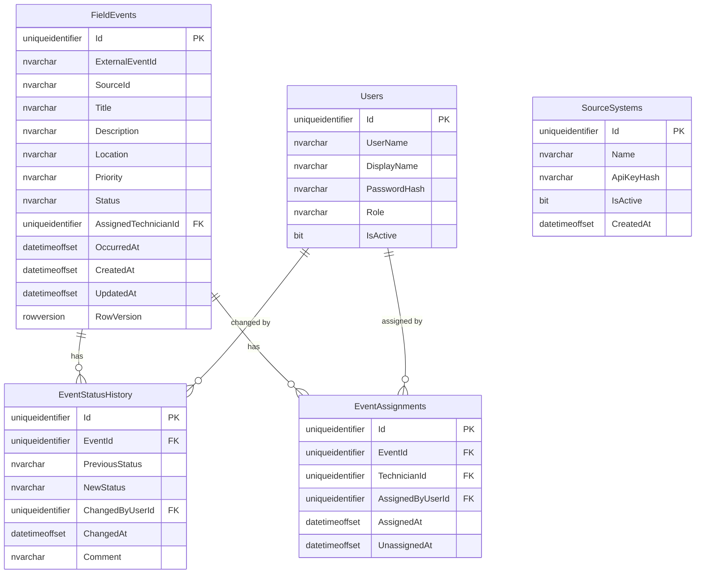

# Data Model

> SQL Server tables are implemented via EF Core Fluent API and an `InitialCreate` migration.

---

## Tables

### FieldEvents

| Column | Type | Notes |
|---|---|---|
| Id | `uniqueidentifier` | PK, generated by app |
| ExternalEventId | `nvarchar(256)` | From external source |
| SourceId | `nvarchar(128)` | Identifies the reporting source |
| Title | `nvarchar(512)` | |
| Description | `nvarchar(max)` | |
| Location | `nvarchar(512)` | |
| Priority | `nvarchar(32)` | Low / Medium / High / Critical |
| Status | `nvarchar(64)` | Enforced by domain state machine |
| AssignedTechnicianId | `uniqueidentifier` | FK → Users, nullable |
| OccurredAt | `datetimeoffset` | When the event occurred |
| CreatedAt | `datetimeoffset` | When the record was created |
| UpdatedAt | `datetimeoffset` | Updated on every write |
| RowVersion | `rowversion` | Optimistic concurrency |

**Unique constraint:** `UNIQUE(SourceId, ExternalEventId)` — idempotency key

---

### EventStatusHistories

| Column | Type | Notes |
|---|---|---|
| Id | `uniqueidentifier` | PK |
| EventId | `uniqueidentifier` | FK → FieldEvents |
| PreviousStatus | `nvarchar(64)` | Nullable for initial creation |
| NewStatus | `nvarchar(64)` | |
| ChangedByUserId | `uniqueidentifier` | FK → Users |
| ChangedAt | `datetimeoffset` | |
| Comment | `nvarchar(1024)` | Optional |

---

### EventAssignments

| Column | Type | Notes |
|---|---|---|
| Id | `uniqueidentifier` | PK |
| EventId | `uniqueidentifier` | FK → FieldEvents |
| TechnicianId | `uniqueidentifier` | FK → Users |
| AssignedByUserId | `uniqueidentifier` | FK → Users |
| AssignedAt | `datetimeoffset` | |
| UnassignedAt | `datetimeoffset` | Nullable |

---

### Users

| Column | Type | Notes |
|---|---|---|
| Id | `uniqueidentifier` | PK |
| UserName | `nvarchar(256)` | Unique |
| DisplayName | `nvarchar(256)` | |
| PasswordHash | `nvarchar(max)` | BCrypt hash |
| Role | `nvarchar(64)` | Dispatcher / Technician |
| IsActive | `bit` | |

---

### SourceSystems

| Column | Type | Notes |
|---|---|---|
| Id | `uniqueidentifier` | PK |
| Name | `nvarchar(256)` | Human-readable name |
| ApiKeyHash | `nvarchar(512)` | SHA-256 hex of plaintext key |
| IsActive | `bit` | |
| CreatedAt | `datetimeoffset` | |

---

### PushSubscriptions *(skeleton)*

| Column | Type | Notes |
|---|---|---|
| Id | `uniqueidentifier` | PK |
| UserId | `uniqueidentifier` | FK → Users |
| Endpoint | `nvarchar(2048)` | Browser push endpoint URL |
| P256dh | `nvarchar(512)` | Encryption key |
| Auth | `nvarchar(512)` | Auth secret |
| CreatedAt | `datetimeoffset` | |
| IsActive | `bit` | |

---

### Notifications *(skeleton)*

| Column | Type | Notes |
|---|---|---|
| Id | `uniqueidentifier` | PK |
| UserId | `uniqueidentifier` | FK → Users |
| Type | `nvarchar(128)` | e.g. `EventCreated`, `EventAssigned` |
| Payload | `nvarchar(max)` | JSON |
| CreatedAt | `datetimeoffset` | |
| DeliveredAt | `datetimeoffset` | Nullable |
| ReadAt | `datetimeoffset` | Nullable |

---

### AgentMessages *(SQLite, in Agent process)*

| Column | Type | Notes |
|---|---|---|
| Id | `INTEGER` | PK, autoincrement |
| SourceId | `TEXT` | |
| ExternalEventId | `TEXT` | |
| IdempotencyKey | `TEXT` | Unique |
| Payload | `TEXT` | Full JSON payload |
| Status | `TEXT` | Pending / Delivered / Failed |
| RetryCount | `INTEGER` | |
| NextRetryAt | `TEXT` | ISO 8601 UTC |
| CreatedAt | `TEXT` | ISO 8601 UTC |
| DeliveredAt | `TEXT` | ISO 8601 UTC, nullable |
| LastError | `TEXT` | Nullable |

---

## ERD

