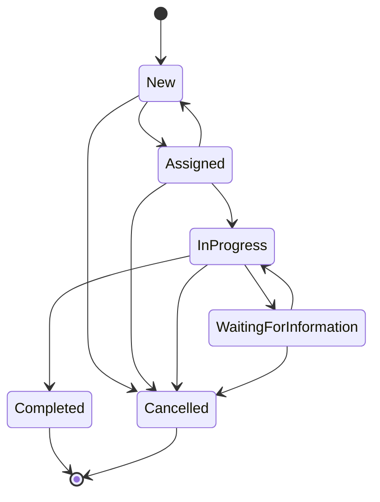

# Event State Machine

> State machine is fully implemented in `FieldEvent.ChangeStatus` with 36 passing unit tests.

---

## States

| State | Description |
|---|---|
| `New` | Event received, not yet assigned |
| `Assigned` | Technician assigned, not yet started |
| `InProgress` | Technician is actively working |
| `WaitingForInformation` | Work paused pending external information |
| `Completed` | Work done, terminal state |
| `Cancelled` | Event cancelled, terminal state |

---

## Allowed transitions

```
New
  → Assigned
  → Cancelled

Assigned
  → New            (unassign)
  → InProgress
  → Cancelled

InProgress
  → WaitingForInformation
  → Completed
  → Cancelled

WaitingForInformation
  → InProgress
  → Cancelled

Completed
  (no transitions — terminal)

Cancelled
  (no transitions — terminal)
```

---

## State diagram

*(Mermaid diagram to be added in Phase 8)*



---

## Enforcement

The `FieldEvent` aggregate enforces transitions via `Transition(EventStatus newStatus, ...)`.
Attempting an invalid transition throws `InvalidEventTransitionException`.

Every successful transition creates an `EventStatusHistory` record containing:
- Event ID
- Previous status
- New status
- Changed-by user ID
- Timestamp (UTC)
- Optional comment

---

## Initial state

A new `FieldEvent` is always created in `New` status.
The initial history record is created at construction time with `PreviousStatus = null`.
